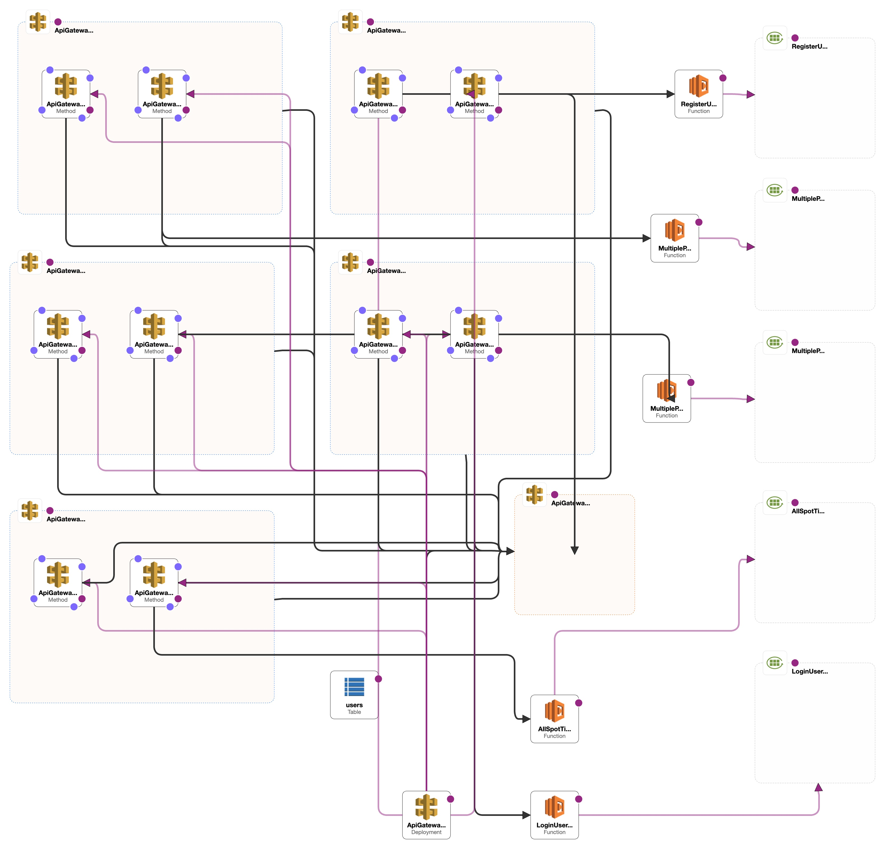

# crypto-dashboard-backend

## Table of Contents
- [Description](#description)
- [Prerequisites](#prerequisites)
- [Installation](#installation)
- [Deployment](#deployment)
- [APIs](#apis)
- [Architecture](#architecture)
- [Technologies](#technologies)
- [Contact](#contact)

## Description

The backend it's designed to work with the frontend code found in the repository at [jparraporcar/crypto-dashboard-frontend](https://github.com/jparraporcar/crypto-dashboard-frontend).


## Prerequisites

Before you begin, ensure you have met the following requirements:

- You have installed the latest version of [Node.js and npm](https://nodejs.org/)
- You have installed the [Serverless framework](https://www.serverless.com/framework/docs/getting-started/)
- You have installed the [AWS CLI](https://aws.amazon.com/cli/)
- You have an AWS account with appropriate access rights and a configured AWS profile

## Setup

### Installation

To setup crypto-dashboard-backend, follow these steps:

1. Clone the repository:

```
git clone https://github.com/jparraporcar/crypto-dashboard-backend.git
```

2. Navigate into the project directory:

```
cd crypto-dash-board-backend
```

3. Install the dependencies:

```
npm install
```

### Deployment

To deploy the backend, run the following command:

```
serverless deploy

```

You will then obtain 5 endpoints to use in the frontend code repo.

## APIs

The `crypto-dashboard-backend` provides five endpoints:

1. `/priceVolumeData`: Retrieves OHLC data of the total amount of all the tokens requested for the current timeframe.
2. `/priceVolumeDataWindow`: Retrieves OHLC data of all the tokens requested for the defined window size.
3. `/registerUser`: Used for user registration.
4. `/loginUser`: Used for user login.
5. `/allSpotTickerNames`: Retrieves the list of all tradable tokens in Binance Spot Market at the moment of the request.

## Architecture

The deployed architecture is designed around the Serverless framework, using AWS Lambda functions for computation, Amazon API Gateway for HTTP request handling, and AWS CloudWatch for logging.



## Technologies

The `crypto-dashboard-backend` utilizes the following technologies and packages for its implementation:

1. **Node.js** - An open-source, cross-platform, JavaScript runtime environment that executes JavaScript code outside of a web browser.
2. **TypeScript** - An open-source language that builds on JavaScript by adding static type definitions.
3. **AWS Lambda** - A serverless compute service that lets you run your code without provisioning or managing servers.
4. **Axios** - A promise-based HTTP client for the browser and Node.js.
5. **Serverless Framework** - An open-source deployment framework that allows developers to build and deploy auto-scaling, pay-per-execution, event-driven functions.

Development dependencies include:

- **ESLint** and **Prettier** for enforcing code style and formatting rules.
- **ts-node** for executing TypeScript code directly.
- **serverless-offline** for enhancing the Serverless Framework development experience.

## Contact

If you want to contact me you can reach me at:

- **Name**: `Jordi Parra Porcar`
- **Email**: `jordiparraporcar@gmail.com`
- **LinkedIn**: [`Jordi Parra Porcar`](https://www.linkedin.com/in/jordiparraporcar/)
